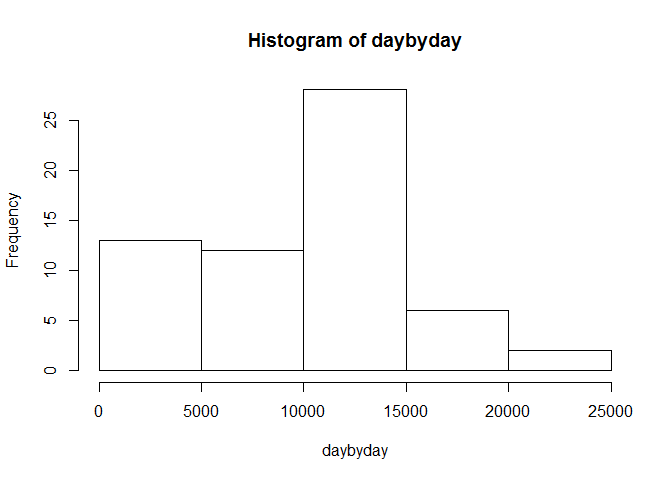
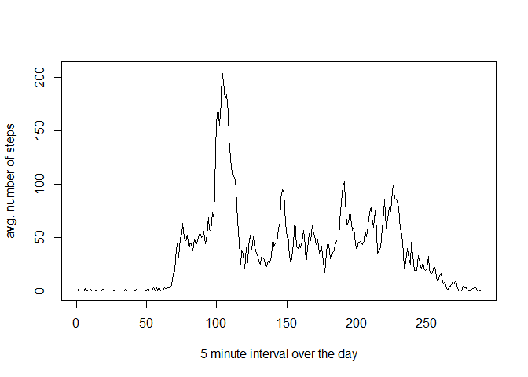
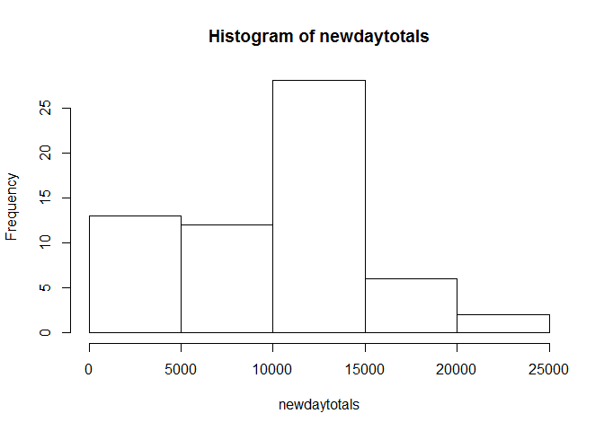
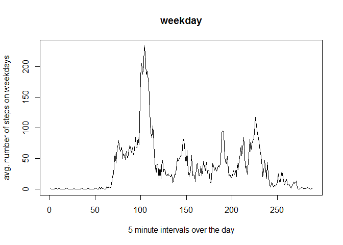
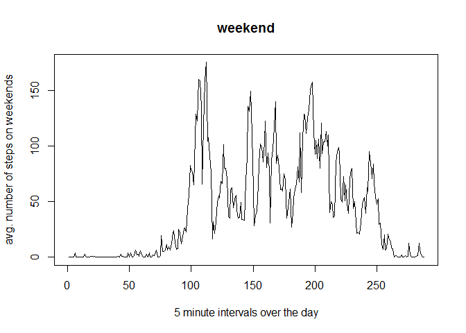

# HW 5 RMD

This is an R Markdown document.  It is for course 5 homework. First, read Le Data. 


```r
ledata <- read.csv("activity.csv")
```
A matrix makes everything better.


```r
library(reshape2)
betterdata <- acast(ledata, date ~ interval , value.var="steps")
```

Sum up steps per day, discarding NA values.


```r
daybyday <- rowSums(betterdata,na.rm = TRUE)
```

Now for Some kind of histogram.


```r
hist(daybyday)
```

 

Mean number of steps per day is

```r
mean(daybyday)
```

```
## [1] 9354.23
```
Median number of steps per day is

```r
median(daybyday)
```

```
## [1] 10395
```

Now we look at intervals across days, assuming NA values do not change the mean.


```r
timeaftertime <- colMeans(betterdata, na.rm = TRUE)
```

plot this


```r
plot(timeaftertime,type="l",ylab="avg. number of steps",xlab="5 minute interval over the day")
```

 

Total rows with NA in them is found.


```r
sum(is.na(rowSums(betterdata)))
```

```
## [1] 8
```
Now to impute daily averages into the NA slots. First, find those days. Then completely NA days are set to 0. Otherwise, each NA is replaced by the daily mean.


```r
impooted <- betterdata
thosedays <- is.na(rowSums(betterdata)) 
demeans <- rowMeans(betterdata, na.rm = TRUE)
demeans[is.nan(demeans)] <- 0
for ( day in thosedays ) {
  thesetimes <- is.na(betterdata[day,])
  for ( everytime in thesetimes ) {
    impooted[day,everytime] <- demeans[day]
  }
}
```
New daily totals, mean and median found.

```r
newdaytotals <- rowSums(impooted)
mean(newdaytotals)
```

```
## [1] 9354.23
```

```r
median(newdaytotals)
```

```
## [1] 10395
```
This looks the same, so we compare total steps in the two datasets

```r
sum(daybyday)
```

```
## [1] 570608
```

```r
sum(newdaytotals)
```

```
## [1] 570608
```

```r
hist(newdaytotals)
```

 
This indicates that the missing values are actually 8 missing days or data, so the daily average imputing changes nothing. 

To split the data into weekdays and weekends use isWeekday function form timedate library.

```r
library(timeDate)
thedroidswerelookingfor <- isWeekday(as.Date(rownames(betterdata)))
weekdata <- betterdata[thedroidswerelookingfor, ]
enddata <- betterdata[!thedroidswerelookingfor, ]
weekactivity <- colMeans(weekdata, na.rm = TRUE)
endactivity <- colMeans(enddata, na.rm = TRUE)
```
now plot these guys.

```r
plot(weekactivity,type="l",ylab = "avg. number of steps on weekdays",xlab="5 minute intervals over the day",main = "weekday")
```

 

```r
plot(endactivity,type="l" ,ylab = "avg. number of steps on weekends",xlab ="5 minute intervals over the day",main = "weekend")
```

 


Now we conlclude people do different things on the weekend than the weekdays. 
